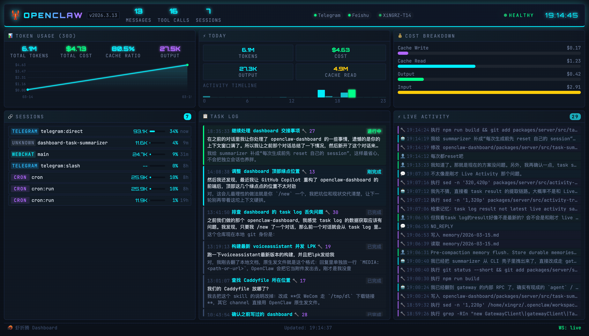

# OpenClaw Dashboard

A cyberpunk-style real-time monitoring dashboard for [OpenClaw](https://github.com/openclaw/openclaw).



## Features

- **Token Usage** — 30-day trend chart with daily cost breakdown
- **Today's Stats** — tokens, cost, output, cache read + hourly activity heatmap
- **Cost Breakdown** — visual bar chart of cache write/read, output, and input costs
- **Sessions** — active sessions with channel badges, token counts, and context window usage bars
- **Task Log** — auto-extracted task summaries from session logs with status indicators
- **Live Activity** — real-time feed of messages, tool calls, and user interactions
- **Channels & Devices** — health status of connected channels and devices in the header

## How It Works

The dashboard server connects directly to the OpenClaw Gateway via its **WebSocket protocol** (device auth v3, ed25519 signing). It fetches health, status, and presence data through Gateway RPC calls, and tails session log files for real-time activity tracking.

Usage cost data is collected via the `openclaw gateway usage-cost` CLI command (no RPC method available yet).

## Project Structure

```
packages/
  server/    — Express + WebSocket backend (TypeScript)
  web/       — React + Vite frontend (TypeScript)
dist/        — Single build output
  server.js  — Compiled server
  public/    — Vite-built frontend assets
```

## Deployment

### Prerequisites

- Node.js 18+
- A running [OpenClaw](https://github.com/openclaw/openclaw) gateway on the same machine

The dashboard connects to the OpenClaw Gateway at `127.0.0.1:18789` (configurable via `GW_PORT`). Both services must run on the same host.

### Build

```bash
git clone https://github.com/xingrz/openclaw-dashboard.git
cd openclaw-dashboard
npm install
npm run build
```

This produces a single `dist/` directory containing the compiled server and frontend assets.

### Run

```bash
npm start
# or directly:
node dist/server.js
```

The dashboard listens on `http://127.0.0.1:3210` by default. It only binds to localhost — use a reverse proxy to expose it externally.

### Environment Variables

| Variable | Default | Description |
|----------|---------|-------------|
| `PORT` | `3210` | Dashboard server port |
| `GW_PORT` | `18789` | Gateway WebSocket port |
| `OPENCLAW_GATEWAY_TOKEN` | *(auto-detected)* | Gateway auth token |

The gateway token is auto-detected from `~/.openclaw/openclaw.json` if not set.

### Reverse Proxy

The dashboard binds to `127.0.0.1` only. Use a reverse proxy to serve it over HTTPS or on a public interface.

**Caddy:**

```caddyfile
your.domain {
    handle_path /dashboard/* {
        reverse_proxy localhost:3210
    }
}
```

**nginx:**

```nginx
location /dashboard/ {
    proxy_pass http://127.0.0.1:3210/;
    proxy_http_version 1.1;
    proxy_set_header Upgrade $http_upgrade;
    proxy_set_header Connection "upgrade";
    proxy_set_header Host $host;
}
```

> **Note:** The `proxy_set_header Upgrade` / `Connection` directives are required for WebSocket support.

### systemd Service

```ini
[Unit]
Description=OpenClaw Dashboard
After=network.target

[Service]
Type=simple
User=your-user
WorkingDirectory=/path/to/openclaw-dashboard
ExecStart=/usr/bin/node dist/server.js
Restart=always
RestartSec=5
Environment=PORT=3210
Environment=PATH=/home/your-user/.npm-global/bin:/usr/local/bin:/usr/bin:/bin

[Install]
WantedBy=multi-user.target
```

```bash
sudo cp openclaw-dashboard.service /etc/systemd/system/
sudo systemctl daemon-reload
sudo systemctl enable --now openclaw-dashboard
```

## Development

Frontend and backend run separately during development:

```bash
# Terminal 1: backend server (auto-reloads on changes)
npm run dev:server

# Terminal 2: Vite dev server with HMR (proxies API/WS to backend)
npm run dev:web
```

The Vite dev server runs on `http://localhost:5173` with hot module replacement.

## License

[MIT](LICENSE)
